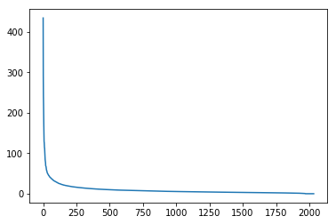

# Computational Linear Algebra

The following listing links to the notebooks in this repository, rendered through the [nbviewer](http://nbviewer.jupyter.org) service.  Topics Covered:

## [1. Why are we here?](http://nbviewer.jupyter.org/github/fastai/numerical-linear-algebra/blob/master/nbs/1.%20Why%20are%20we%20here.ipynb) ([Video 1](https://www.youtube.com/watch?v=8iGzBMboA0I&index=1&list=PLtmWHNX-gukIc92m1K0P6bIOnZb-mg0hY))

We start with a high level overview of some foundational concepts in numerical linear algebra.

- [Matrix and Tensor Products](http://nbviewer.jupyter.org/github/fastai/numerical-linear-algebra/blob/master/nbs/1.%20Why%20are%20we%20here.ipynb#Matrix-and-Tensor-Products)
- [Matrix Decompositions](http://nbviewer.jupyter.org/github/fastai/numerical-linear-algebra/blob/master/nbs/1.%20Why%20are%20we%20here.ipynb#Matrix-Decompositions)
- [Accuracy](http://nbviewer.jupyter.org/github/fastai/numerical-linear-algebra/blob/master/nbs/1.%20Why%20are%20we%20here.ipynb#Accuracy)
- [Memory use](http://nbviewer.jupyter.org/github/fastai/numerical-linear-algebra/blob/master/nbs/1.%20Why%20are%20we%20here.ipynb#Memory-Use)
- [Speed](http://nbviewer.jupyter.org/github/fastai/numerical-linear-algebra/blob/master/nbs/1.%20Why%20are%20we%20here.ipynb#Speed)
- [Parallelization & Vectorization](http://nbviewer.jupyter.org/github/fastai/numerical-linear-algebra/blob/master/nbs/1.%20Why%20are%20we%20here.ipynb#Scalability-/-parallelization)

## [2. Topic Modeling with NMF and SVD](http://nbviewer.jupyter.org/github/fastai/numerical-linear-algebra/blob/master/nbs/2.%20Topic%20Modeling%20with%20NMF%20and%20SVD.ipynb) ([Video 2](https://www.youtube.com/watch?v=kgd40iDT8yY&list=PLtmWHNX-gukIc92m1K0P6bIOnZb-mg0hY&index=2) and [Video 3](https://www.youtube.com/watch?v=C8KEtrWjjyo&index=3&list=PLtmWHNX-gukIc92m1K0P6bIOnZb-mg0hY))

We will use the newsgroups dataset to try to identify the topics of different posts.  We use a term-document matrix that represents the frequency of the vocabulary in the documents.  We factor it using NMF, and then with SVD.

### 2.1 Bag of Word

```python
vectorizer = CountVectorizer(stop_words='english')
vectors = vectorizer.fit_transform(newsgroups_train.data).todense() # (documents, vocab)
```

### 2.2 SVD - Topic Model

#### SVD矩阵分解

 $A=U\Sigma V^T$

矩阵 $A$ ：row是words，column是documents；

矩阵 $U$ ：row是words，column是topics；U的列是orthonormal的；

矩阵$V^T$：row是topics，column是documents；V的行是orthonormal的；

````python
%time U, s, Vh = linalg.svd(vectors, full_matrices=False)

reconstructed_vectors = U @ np.diag(s) @ Vh

# 矩阵的norm，就是拉成一个长向量，然后计算向量的norm，在这里norm用于计算两个矩阵的距离
np.linalg.norm(reconstructed_vectors - vectors) 

# 判断两个矩阵是否可以视为相等
np.allclose(reconstructed_vectors, vectors)
````

确认 $U$ 和 $V^T$ 都是orthonormal的：

```python
# U的column是orthonormal， Vh的row是orthonormal，则 UTU=I, VVT=I
np.allclose(U.T @ U, np.eye(U.shape[1]))
np.allclose(Vh @ Vh.T, np.eye(Vh.shape[0]))

```

#### check一下对角矩阵$\Sigma$



eigenvalue的值下降得很快，说明前几个eigenvalue占据大半壁江山


### 2.3 NMF

NMF is a factorization of a non-negative data set $V$（ $V=WH$）into non-negative matrices $W,H$. Often positive factors will be **more easily interpretable** (and this is the reason behind NMF's popularity).


将 $V$ 分解为两个矩阵 $W$ 和 $H$ ，只要 $W$ 和 $H$ 的entries都是non-negative的就好，不需要是orthogonal的。

矩阵 $V$ 的Column是一张张face的图片。

矩阵的乘法 $AB$ 可以看作是对矩阵A做linear combination。因此，NMF可以从这个角度解释一发，**$W$ 矩阵是各种facial feature，而 $H$ 矩阵就是在将各种feature做Linear Combination，最后组合成一张face。**

#### NMF - Topic Modeling


矩阵 $H$ 的column代表 for each document，it's relative importance for each topic。

因此矩阵 $W$ 的row很明显代表topic，$H$ 的column对 $W$ 的row进行一个加权，最终得到该document所属的topic。

#### NMF with TF-IDF

**Topic Frequency-Inverse Document Frequency**

TF = (# occurrences of term t in document) / (# of words in documents)

IDF = log(# of documents / # documents with term t in it)

> IDF measures how rare a word is. If a word only shows up in some kind of documents, it's very important for this topic.

```python
vectorizer_tfidf = TfidfVectorizer(stop_words='english')
vectors_tfidf = vectorizer_tfidf.fit_transform(newsgroups_train.data) # (documents, vocab)

clf = decomposition.NMF(n_components=d, random_state=1)
W1 = clf.fit_transform(vectors_tfidf)
H1 = clf.components_
```

#### NMF from scratch

##### Applying SGD to NMF

**Goal**: Decompose $V\;(m \times n)$ into $$V \approx WH$$ where $W\;(m \times d)$ and $H\;(d \times n)$, $W,\;H\;>=\;0$, and we've minimized the Frobenius norm of $V-WH$.

**Approach**: We will pick random positive $W$ & $H$, and then use SGD to optimize.

**To use SGD, we need to know the gradient of the loss function.**

**Sources**:
- Optimality and gradients of NMF: http://users.wfu.edu/plemmons/papers/chu_ple.pdf
- Projected gradients: https://www.csie.ntu.edu.tw/~cjlin/papers/pgradnmf.pdf


```python
mu = 1e-6
def grads(M, W, H):
    R = W@H-M
    return R@H.T + penalty(W, mu)*lam, W.T@R + penalty(H, mu)*lam # dW, dH

```

grads这样设计是因为NMF的目标有两个：

 - $WH ≈ M$
 - $W$ and $H$ 都是 positive

`penalty` 是惩罚项，惩罚 when W and H are negative，kind of force them to learn to be positive。

loss $R$ 对 $W$ 求导结果 `dH = W.T@R` 的推导可以从维度的角度考虑：`dw.shape = (mxn)@(nxd) = mxd = W.shape`


```python
# M中entries>μ的，惩罚项为0，否则惩罚项为M-μ
def penalty(M, mu):
    return np.where(M>=mu,0, np.min(M - mu, 0))
```

```python
def upd(M, W, H, lr):
    dW,dH = grads(M,W,H)
    W -= lr*dW; H -= lr*dH
```

如果upd的过程中negative entries的count增加了，可以考虑increase penalty惩罚项。

### 2.4 SVD与NMF实例

#### SVD

以一个实际的例子来看看SVD到底啥意思。

矩阵 $A$ 长这样，row代表某document，column代表64 top words的tf-idf：

| A                   | adams    | allworthy | bounderby | brandon  | catherine   | cathy    | corporal | crawley  | darcy   | dashwood | did      | earnshaw | edgar    | elinor   | emma     | father   | ferrars  | finn     | glegg    | good     | gradgrind | hareton  | heathcliff | jennings | jones    | joseph   | know     | lady     | laura    | like     | linton   | little   | ll       | lopez    | louisa   | lyndon   | maggie   | man      | marianne | miss     | mr       | mrs      | old      | osborne  | pendennis   | philip   | phineas  | quoth    | said     | sissy    | sophia   | sparsit  | stephen  | thought  | time     | tis      | toby     | tom      | trim     | tulliver | uncle    | wakem    | wharton  | willoughby |
| ------------------- | -------- | --------- | --------- | -------- | ----------- | -------- | -------- | -------- | ------- | -------- | -------- | -------- | -------- | -------- | -------- | -------- | -------- | -------- | -------- | -------- | --------- | -------- | ---------- | -------- | -------- | -------- | -------- | -------- | -------- | -------- | -------- | -------- | -------- | -------- | -------- | -------- | -------- | -------- | -------- | -------- | -------- | -------- | -------- | -------- | ----------- | -------- | -------- | -------- | -------- | -------- | -------- | -------- | -------- | -------- | -------- | -------- | -------- | -------- | -------- | -------- | -------- | -------- | -------- | ---------- |
| Sterne_Tristram     | 0        | 0         | 0         | 0        | 0           | 0        | 0.154664 | 0        | 0       | 0        | 0.04909  | 0        | 0        | 0        | 0        | 0.184243 | 0        | 0        | 0        | 0.056896 | 0         | 0        | 0          | 0        | 0        | 0.001043 | 0.040875 | 0.005957 | 0        | 0.050323 | 0        | 0.053815 | 0.023416 | 0        | 0        | 0        | 0        | 0.089965 | 0        | 0.000851 | 0.010681 | 0.021713 | 0.017664 | 0        | 0           | 0.000522 | 0        | 0.141643 | 0.170482 | 0        | 0        | 0        | 0        | 0.021362 | 0.070041 | 0.105531 | 0.755171 | 0.009257 | 0.126161 | 0        | 0.224577 | 0        | 0.000522 | 0          |
| Austen_Pride        | 0        | 0         | 0         | 0        | 0.067989879 | 0        | 0        | 0        | 0.48246 | 0        | 0.086367 | 0        | 0        | 0        | 0        | 0.043024 | 0        | 0        | 0        | 0.064058 | 0         | 0        | 0          | 0        | 0.002588 | 0        | 0.075531 | 0.060871 | 0        | 0.02454  | 0        | 0.060234 | 0.00033  | 0        | 0.003699 | 0        | 0        | 0.048123 | 0        | 0.093472 | 0.250178 | 0.113289 | 0.004143 | 0        | 0           | 0        | 0        | 0        | 0.127798 | 0        | 0        | 0        | 0        | 0.035694 | 0.064696 | 0.001231 | 0        | 0        | 0.00046  | 0        | 0.02279  | 0        | 0        | 0          |
| Thackeray_Pendennis | 0        | 0         | 0         | 0        | 0.001074284 | 0        | 0.000515 | 0.001641 | 0       | 0        | 0.074362 | 0        | 0        | 0        | 0.000908 | 0.029948 | 0        | 0.000374 | 0        | 0.103802 | 0         | 0        | 0          | 0        | 0.002267 | 0.000215 | 0.070809 | 0.101265 | 0.159033 | 0.069921 | 0.001121 | 0.125121 | 0.037876 | 0        | 0.000245 | 0        | 0        | 0.114335 | 0        | 0.086535 | 0.18857  | 0.078513 | 0.122964 | 0        | 0.391460539 | 0        | 0        | 0        | 0.241233 | 0        | 0        | 0        | 0        | 0.052409 | 0.055201 | 0.001471 | 0        | 0.007026 | 0.001464 | 0        | 0.025382 | 0        | 0        | 0          |
| ABronte_Agnes       | 0        | 0         | 0         | 0        | 0           | 0        | 0        | 0        | 0       | 0        | 0.138309 | 0        | 0        | 0        | 0        | 0.053506 | 0        | 0        | 0        | 0.119127 | 0         | 0        | 0          | 0        | 0        | 0.001709 | 0.121147 | 0.057545 | 0        | 0.140328 | 0        | 0.190806 | 0.039758 | 0        | 0        | 0        | 0        | 0.049468 | 0        | 0.190421 | 0.157491 | 0.040805 | 0.069659 | 0        | 0           | 0        | 0        | 0        | 0.187777 | 0        | 0        | 0        | 0        | 0.096917 | 0.150424 | 0.0013   | 0        | 0.0416   | 0.001456 | 0        | 0.010463 | 0        | 0        | 0          |
| Austen_Sense        | 0        | 0         | 0         | 0.145879 | 0           | 0        | 0        | 0        | 0       | 0.255289 | 0.068761 | 0        | 0        | 0.616621 | 0        | 0.008351 | 0.131697 | 0        | 0        | 0.049274 | 0         | 0        | 0          | 0.233002 | 0        | 0        | 0.064585 | 0.03953  | 0        | 0.023106 | 0        | 0.044541 | 0.000866 | 0        | 0        | 0        | 0        | 0.033684 | 0.429012 | 0.060586 | 0.049552 | 0.152909 | 0.012249 | 0        | 0           | 0        | 0        | 0        | 0.110518 | 0        | 0.001329 | 0        | 0        | 0.032292 | 0.066534 | 0.002151 | 0        | 0        | 0.000401 | 0        | 0.004905 | 0        | 0        | 0.17714    |
| Thackeray_Vanity    | 0        | 0         | 0         | 0        | 0.000228652 | 0        | 0.002193 | 0.456333 | 0       | 0        | 0.066577 | 0        | 0        | 0        | 0.000322 | 0.04335  | 0        | 0        | 0        | 0.084944 | 0         | 0        | 0          | 0        | 0.003729 | 0.023323 | 0.046726 | 0.10358  | 0.001442 | 0.048751 | 0.000398 | 0.151926 | 0.019874 | 0        | 0.000784 | 0        | 0        | 0.067523 | 0.000368 | 0.147235 | 0.106821 | 0.114765 | 0.123972 | 0.274237 | 0           | 0.000686 | 0        | 0        | 0.181501 | 0        | 0.000322 | 0        | 0        | 0.050912 | 0.046051 | 0.001043 | 0        | 0.005912 | 0.001947 | 0        | 0.003079 | 0        | 0        | 0          |
| Trollope_Barchester | 0        | 0         | 0         | 0        | 0           | 0        | 0.000369 | 0        | 0       | 0        | 0.10872  | 0        | 0        | 0        | 0        | 0.049997 | 0        | 0        | 0        | 0.050178 | 0         | 0        | 0          | 0        | 0.001181 | 0        | 0.057269 | 0.03727  | 0        | 0.030362 | 0        | 0.059996 | 0.023364 | 0        | 0        | 0        | 0        | 0.096539 | 0        | 0.039945 | 0.388155 | 0.142821 | 0.041088 | 0        | 0           | 0        | 0        | 0        | 0.233984 | 0        | 0        | 0        | 0        | 0.04727  | 0.035998 | 0.000702 | 0        | 0.00398  | 0.000786 | 0        | 0.000188 | 0        | 0        | 0          |
| Fielding_Tom        | 0.000434 | 0.347432  | 0         | 0        | 0.00026991  | 0        | 0.000971 | 0        | 0       | 0        | 0.080504 | 0        | 0        | 0        | 0        | 0.047186 | 0        | 0        | 0        | 0.118763 | 0         | 0        | 0          | 0        | 0.419696 | 0        | 0.075403 | 0.114459 | 0        | 0.038578 | 0        | 0.102343 | 0.009252 | 0        | 0        | 0        | 0        | 0.114618 | 0        | 0.019164 | 0.194006 | 0.104578 | 0.025347 | 0.000515 | 0           | 0        | 0        | 0.006467 | 0.15208  | 0        | 0.342367 | 0        | 0        | 0.049259 | 0.084011 | 0.003079 | 0        | 0.031817 | 0        | 0        | 0.014043 | 0        | 0        | 0.00047    |
| Dickens_Bleak       | 0        | 0         | 0         | 0        | 0           | 0        | 0        | 0        | 0       | 0        | 0.05547  | 0        | 0        | 0        | 0.004773 | 0.019201 | 0        | 0        | 0        | 0.086405 | 0         | 0        | 0          | 0        | 0.000866 | 0        | 0.119074 | 0.098539 | 0.001139 | 0.085205 | 0        | 0.153609 | 0.030264 | 0        | 0        | 0        | 0        | 0.083872 | 0        | 0.079321 | 0.412558 | 0.093417 | 0.102006 | 0        | 0           | 0        | 0        | 0.001708 | 0.232414 | 0        | 0        | 0        | 0        | 0.046136 | 0.088405 | 0.001545 | 0        | 0.013049 | 0.000769 | 0        | 0.001106 | 0        | 0        | 0          |
| Eliot_Mill          | 0        | 0         | 0         | 0        | 0           | 0        | 0        | 0        | 0       | 0        | 0.03488  | 0        | 0        | 0        | 0        | 0.060763 | 0        | 0        | 0.185358 | 0.048168 | 0         | 0        | 0          | 0        | 0        | 0        | 0.056611 | 0.008305 | 0.00266  | 0.076265 | 0        | 0.055503 | 0.050637 | 0        | 0.000268 | 0        | 0.706176 | 0.040832 | 0        | 0.022234 | 0.128724 | 0.08406  | 0.030312 | 0        | 0           | 0.157882 | 0        | 0        | 0.228104 | 0        | 0.00033  | 0        | 0.106653 | 0.045676 | 0.035295 | 0        | 0.000448 | 0.217086 | 0        | 0.361651 | 0.020082 | 0.112323 | 0        | 0          |
| EBronte_Wuthering   | 0        | 0         | 0         | 0        | 0.222505091 | 0.155236 | 0        | 0        | 0       | 0        | 0.082908 | 0.163999 | 0.145221 | 0        | 0        | 0.04369  | 0        | 0        | 0        | 0.04025  | 0         | 0.224091 | 0.595906   | 0        | 0        | 0.081546 | 0.042314 | 0.024081 | 0        | 0.053667 | 0.41146  | 0.061235 | 0.131916 | 0        | 0        | 0        | 0        | 0.031306 | 0        | 0.046705 | 0.107334 | 0.047418 | 0.02821  | 0        | 0           | 0        | 0        | 0        | 0.129007 | 0        | 0        | 0        | 0        | 0.040594 | 0.04369  | 0        | 0        | 0        | 0.000496 | 0        | 0.00927  | 0        | 0        | 0          |
| Eliot_Middlemarch   | 0        | 0         | 0         | 0        | 0.000205004 | 0        | 0        | 0        | 0       | 0        | 0.064293 | 0        | 0        | 0.003524 | 0        | 0.022521 | 0        | 0        | 0        | 0.074827 | 0         | 0        | 0          | 0        | 0        | 0.00123  | 0.084997 | 0.012834 | 0.000259 | 0.083786 | 0        | 0.075674 | 0.013552 | 0        | 0.002108 | 0        | 0        | 0.083786 | 0        | 0.019575 | 0.240099 | 0.087837 | 0.038866 | 0        | 0           | 0        | 0        | 0        | 0.277512 | 0        | 0.000289 | 0        | 0        | 0.0494   | 0.047705 | 0.000312 | 0        | 0.001247 | 0.000175 | 0        | 0.019199 | 0        | 0        | 0.000357   |
| Fielding_Joseph     | 0.661414 | 0.001127  | 0         | 0        | 0           | 0        | 0        | 0        | 0       | 0        | 0.075629 | 0        | 0        | 0        | 0        | 0.01882  | 0        | 0        | 0        | 0.086433 | 0         | 0        | 0          | 0        | 0.000566 | 0.319243 | 0.050536 | 0.109784 | 0        | 0.036943 | 0        | 0.08957  | 0.007224 | 0        | 0.000674 | 0        | 0        | 0.103859 | 0.000949 | 0.006502 | 0.113967 | 0.044427 | 0.020563 | 0        | 0           | 0        | 0        | 0.009673 | 0.129302 | 0        | 0.000832 | 0        | 0        | 0.036943 | 0.058203 | 0.001795 | 0        | 0.004039 | 0        | 0        | 0.000361 | 0        | 0        | 0          |
| ABronte_Tenant      | 0        | 0         | 0         | 0        | 0           | 0        | 0        | 0        | 0       | 0        | 0.144772 | 0        | 0        | 0        | 0        | 0.032717 | 0        | 0        | 0        | 0.103058 | 0         | 0        | 0          | 0        | 0        | 0        | 0.14927  | 0.05521  | 0        | 0.099377 | 0        | 0.147225 | 0.07968  | 0        | 0        | 0        | 0        | 0.064616 | 0        | 0.03433  | 0.148452 | 0.094938 | 0.04703  | 0        | 0           | 0        | 0        | 0        | 0.281364 | 0        | 0        | 0        | 0        | 0.080156 | 0.121052 | 0        | 0        | 0.000527 | 0.00059  | 0        | 0.020344 | 0        | 0        | 0          |
| Austen_Emma         | 0        | 0         | 0         | 0        | 0.000372779 | 0        | 0        | 0        | 0       | 0        | 0.077499 | 0        | 0        | 0        | 0.454461 | 0.045575 | 0        | 0        | 0        | 0.078821 | 0         | 0        | 0          | 0        | 0        | 0        | 0.074197 | 0.016072 | 0        | 0.044034 | 0        | 0.079041 | 0        | 0        | 0        | 0        | 0        | 0.05174  | 0        | 0.136677 | 0.253855 | 0.159495 | 0.018714 | 0        | 0           | 0.000559 | 0        | 0        | 0.106562 | 0        | 0        | 0        | 0        | 0.049758 | 0.061427 | 0.000567 | 0        | 0.000284 | 0        | 0        | 0.005248 | 0        | 0        | 0          |
| Trollope_Prime      | 0        | 0         | 0         | 0        | 0.000273278 | 0        | 0        | 0        | 0       | 0        | 0.122827 | 0        | 0        | 0        | 0        | 0.083122 | 0        | 0.087963 | 0        | 0.063592 | 0         | 0        | 0          | 0        | 0.002097 | 0        | 0.122504 | 0.045031 | 0.000345 | 0.064884 | 0        | 0.060042 | 0.028604 | 0.496312 | 0        | 0        | 0        | 0.197556 | 0        | 0.002007 | 0.200623 | 0.078785 | 0.081992 | 0        | 0           | 0        | 0.074633 | 0        | 0.236938 | 0        | 0        | 0        | 0        | 0.069726 | 0.069564 | 0.000208 | 0        | 0.000208 | 0        | 0        | 0.003011 | 0        | 0.289894 | 0          |
| CBronte_Villette    | 0        | 0         | 0         | 0        | 0.00061086  | 0        | 0        | 0        | 0       | 0        | 0.164878 | 0        | 0        | 0        | 0        | 0.026337 | 0        | 0        | 0        | 0.10607  | 0         | 0        | 0          | 0        | 0.001172 | 0.001833 | 0.113286 | 0.034996 | 0.00077  | 0.149364 | 0        | 0.184721 | 0.0086   | 0        | 0.003489 | 0        | 0        | 0.063859 | 0        | 0.056833 | 0.016596 | 0.057955 | 0.058086 | 0        | 0           | 0        | 0        | 0        | 0.213223 | 0        | 0        | 0        | 0        | 0.110761 | 0.086588 | 0        | 0        | 0        | 0.004162 | 0        | 0.006356 | 0        | 0        | 0          |
| CBronte_Jane        | 0        | 0         | 0         | 0        | 0.000638765 | 0        | 0        | 0        | 0       | 0        | 0.148642 | 0        | 0        | 0        | 0        | 0.021127 | 0        | 0        | 0        | 0.089034 | 0         | 0        | 0          | 0        | 0        | 0        | 0.086016 | 0.036972 | 0        | 0.152038 | 0        | 0.129025 | 0.031279 | 0        | 0.010946 | 0        | 0        | 0.055081 | 0        | 0.121205 | 0.205232 | 0.098137 | 0.04414  | 0        | 0           | 0        | 0        | 0        | 0.219945 | 0        | 0        | 0        | 0        | 0.096203 | 0.091675 | 0        | 0        | 0        | 0.001088 | 0        | 0.010557 | 0        | 0.000958 | 0          |
| Richardson_Clarissa | 0        | 0         | 0         | 0        | 0           | 0        | 0.000373 | 0        | 0       | 0        | 0.062295 | 0        | 0        | 0        | 0        | 0.056348 | 0        | 0        | 0        | 0.094485 | 0         | 0        | 0          | 0        | 0        | 0.013496 | 0.115455 | 0.114167 | 0        | 0.043778 | 0        | 0.062725 | 0.017093 | 0        | 0        | 0        | 0        | 0.160153 | 0.000167 | 0.143864 | 0.156106 | 0.072504 | 0.022502 | 0        | 0           | 0.000467 | 0        | 0.000262 | 0.126553 | 0        | 0        | 0        | 0.000501 | 0.077011 | 0.09332  | 0.016185 | 0        | 0.001263 | 8.84E-05 | 0        | 0.04124  | 0        | 0.000156 | 0          |
| CBronte_Professor   | 0        | 0         | 0         | 0        | 0.001182147 | 0        | 0        | 0        | 0       | 0        | 0.12777  | 0        | 0        | 0        | 0        | 0.013964 | 0        | 0        | 0        | 0.079594 | 0         | 0        | 0          | 0        | 0        | 0        | 0.078896 | 0.021644 | 0        | 0.125675 | 0        | 0.13545  | 0.032561 | 0        | 0        | 0        | 0        | 0.064234 | 0        | 0.002171 | 0.071914 | 0.019537 | 0.049572 | 0        | 0           | 0        | 0        | 0        | 0.15849  | 0        | 0        | 0        | 0        | 0.103333 | 0.09286  | 0        | 0        | 0        | 0.002013 | 0        | 0.002171 | 0        | 0.008869 | 0          |
| Dickens_Hard        | 0        | 0         | 0.593468  | 0        | 0           | 0        | 0        | 0        | 0       | 0        | 0.042057 | 0        | 0        | 0        | 0.002888 | 0.065354 | 0        | 0        | 0        | 0.054764 | 0.346832  | 0        | 0          | 0        | 0.000491 | 0.000512 | 0.085626 | 0.029349 | 0        | 0.049923 | 0        | 0.060513 | 0.038255 | 0        | 0.158604 | 0        | 0        | 0.058698 | 0        | 0.011916 | 0.197575 | 0.122919 | 0.04478  | 0        | 0           | 0        | 0        | 0.000646 | 0.219965 | 0.162956 | 0        | 0.324811 | 0.148287 | 0.023298 | 0.053857 | 0.021428 | 0        | 0.087662 | 0        | 0        | 0.000627 | 0        | 0        | 0          |
| Eliot_Adam          | 0        | 0         | 0         | 0        | 0.000309359 | 0        | 0        | 0        | 0       | 0        | 0.035446 | 0        | 0        | 0        | 0        | 0.019368 | 0        | 0        | 0        | 0.076374 | 0         | 0        | 0          | 0        | 0        | 0.000619 | 0.08551  | 0.008405 | 0        | 0.11986  | 0        | 0.080394 | 0.092217 | 0        | 0        | 0        | 0        | 0.0835   | 0        | 0.013255 | 0.094097 | 0.057565 | 0.073085 | 0        | 0           | 0        | 0        | 0        | 0.221813 | 0        | 0        | 0        | 0        | 0.066873 | 0.054448 | 0.000471 | 0        | 0.002588 | 0        | 0        | 0.010793 | 0        | 0        | 0          |
| Dickens_David       | 0.001931 | 0         | 0         | 0        | 0           | 0        | 0        | 0        | 0       | 0        | 0.055917 | 0        | 0        | 0        | 0.003667 | 0.014541 | 0        | 0        | 0        | 0.068685 | 0         | 0        | 0          | 0        | 0.001152 | 0        | 0.097412 | 0.016196 | 0        | 0.075778 | 0        | 0.129567 | 0.034182 | 0        | 0.000457 | 0        | 0        | 0.046933 | 0        | 0.0876   | 0.294008 | 0.082454 | 0.075896 | 0        | 0           | 0        | 0        | 0        | 0.348861 | 0        | 0        | 0        | 0        | 0.052962 | 0.079206 | 0.003653 | 0        | 0.002283 | 0.000852 | 0        | 0.005758 | 0        | 0        | 0          |
| Trollope_Phineas    | 0        | 0         | 0         | 0        | 0           | 0        | 0        | 0        | 0       | 0        | 0.088771 | 0        | 0        | 0        | 0        | 0.033064 | 0        | 0.208072 | 0        | 0.041555 | 0         | 0        | 0          | 0        | 0.013791 | 0        | 0.073976 | 0.136501 | 0.206828 | 0.039368 | 0        | 0.043871 | 0.026533 | 0        | 0        | 0        | 0        | 0.100736 | 0        | 0.0292   | 0.254863 | 0.028133 | 0.030748 | 0        | 0           | 0        | 0.621107 | 0        | 0.251132 | 0        | 0        | 0        | 0        | 0.047602 | 0.03731  | 0        | 0        | 0.000166 | 0        | 0        | 0.0036   | 0        | 0        | 0          |
| Richardson_Pamela   | 0.015995 | 0         | 0         | 0        | 0           | 0        | 0.000243 | 0        | 0       | 0        | 0.067977 | 0        | 0        | 0        | 0        | 0.052392 | 0        | 0        | 0        | 0.18403  | 0         | 0        | 0          | 0        | 0.010515 | 0.000203 | 0.114135 | 0.1736   | 0        | 0.047716 | 0        | 0.105623 | 0.067343 | 0        | 0        | 0        | 0        | 0.058866 | 0        | 0.052185 | 0.169644 | 0.151709 | 0.017624 | 0        | 0           | 0        | 0        | 0.000512 | 0.474643 | 0        | 0        | 0        | 0        | 0.074691 | 0.072533 | 0.034118 | 0        | 0.000618 | 0        | 0        | 0.006709 | 0        | 0        | 0          |
| Sterne_Sentimental  | 0        | 0         | 0         | 0        | 0           | 0        | 0.0053   | 0        | 0       | 0        | 0.058754 | 0        | 0        | 0        | 0        | 0.006528 | 0        | 0        | 0        | 0.095312 | 0         | 0        | 0          | 0        | 0        | 0        | 0.035252 | 0.063977 | 0        | 0.040475 | 0        | 0.155372 | 0.029769 | 0        | 0        | 0        | 0        | 0.134482 | 0        | 0        | 0.010445 | 0        | 0.052226 | 0        | 0           | 0        | 0        | 0.027875 | 0.459588 | 0        | 0        | 0        | 0        | 0.037864 | 0.096618 | 0.104238 | 0        | 0        | 0        | 0        | 0        | 0        | 0        | 0          |
| Thackeray_Barry     | 0        | 0         | 0         | 0        | 0.000784089 | 0        | 0.012219 | 0        | 0       | 0        | 0.095398 | 0        | 0        | 0        | 0        | 0.037974 | 0        | 0        | 0        | 0.081968 | 0         | 0        | 0          | 0        | 0.002256 | 0.001568 | 0.067612 | 0.133371 | 0        | 0.055571 | 0        | 0.084746 | 0.023517 | 0        | 0        | 0.439845 | 0        | 0.159768 | 0        | 0.024477 | 0.068538 | 0.029276 | 0.119479 | 0        | 0.001497461 | 0        | 0        | 0        | 0.22738  | 0        | 0        | 0        | 0.001261 | 0.040752 | 0.090767 | 0.005367 | 0        | 0.000596 | 0.001335 | 0        | 0.053753 | 0        | 0        | 0          |


来看看 $A=USV$ 的 $U$ 、$S$ 、 $V$ 矩阵长啥样。

* 矩阵U的row代表某一篇document：

| U                   | Topic 1     | Topic 2      | Topic 3     | Topic 4 | Topic 5 | Topic 6 | Topic 7 | Topic 8 | Topic 9 | Topic 10 |
| ------------------- | ----------- | ------------ | ----------- | ------- | ------- | ------- | ------- | ------- | ------- | -------- |
| Sterne_Tristram     | 0.129751547 | 0.364025059  | 0.260275157 | -0.182  | 0.4704  | 0.2746  | 0.4213  | 0.0013  | -0.201  | -0.182   |
| Austen_Pride        | 0.161144823 | -0.282351565 | 0.035849616 | 0.2774  | 0.0716  | 0.1661  | 0.1933  | -0.057  | 0.0108  | -0.103   |
| Thackeray_Pendennis | 0.204963633 | -0.034791727 | 0.106094188 | -0.123  | -0.205  | -0.184  | -0.103  | -0.052  | -0.166  | -0.218   |
| ABronte_Agnes       | 0.24516505  | 0.019138479  | -0.08736866 | 0.1915  | -0.061  | 0.0171  | 0.0559  | -0.074  | 0.0763  | -0.054   |
| Austen_Sense        | 0.124659744 | -0.038903724 | 0.058380493 | 0.4942  | 0.4909  | -0.484  | -0.209  | 0.3714  | -0.22   | 0.0525   |
| Thackeray_Vanity    | 0.176643922 | 0.007368815  | 0.11887351  | 0.0101  | -0.196  | -0.247  | -0.182  | -0.386  | -0.307  | -0.455   |
| Trollope_Barchester | 0.177411515 | -0.315466416 | -0.04697274 | -0.12   | 0.0471  | 0.0727  | 0.1426  | 0.0236  | -0.021  | 0.0676   |
| Fielding_Tom        | 0.1948953   | -0.036130893 | 0.382663476 | 0.0579  | -0.027  | 0.1056  | -0.106  | -0.002  | 0.1321  | 0.1055   |
| Dickens_Bleak       | 0.226788058 | -0.19859478  | -0.02668    | -0.058  | -0.082  | 0.015   | 0.0147  | -0.049  | -0.107  | 0.0386   |
| Eliot_Mill          | 0.139439656 | -0.027072394 | -0.3203955  | -0.219  | 0.4418  | 0.0549  | -0.403  | -0.084  | 0.5387  | -0.376   |
| EBronte_Wuthering   | 0.143201879 | 0.116508228  | -0.18859589 | 0.167   | -0.204  | 0.5665  | -0.244  | 0.5019  | -0.288  | -0.286   |
| Eliot_Middlemarch   | 0.176964515 | -0.154880046 | -0.11013136 | -0.155  | 0.0338  | 0.0177  | 0.0393  | 0.0955  | -0.006  | 0.1924   |
| Fielding_Joseph     | 0.159282789 | 0.063282053  | 0.466720853 | 0.0944  | -0.115  | 0.2372  | -0.397  | -0.012  | 0.2739  | 0.276    |
| ABronte_Tenant      | 0.248126515 | 0.08190095   | -0.10770027 | 0.0701  | -0.06   | -0.015  | 0.0165  | 0.0289  | 0.0016  | 0.0105   |
| Austen_Emma         | 0.161847677 | -0.304327437 | -0.07807475 | 0.3369  | 0.0436  | 0.1298  | 0.3376  | -0.25   | 0.1419  | -0.095   |
| Trollope_Prime      | 0.20516582  | -0.14025458  | 0.036573543 | -0.21   | -0.073  | -0.156  | 0.1072  | 0.2481  | 0.0882  | 0.0205   |
| CBronte_Villette    | 0.225099395 | 0.310023446  | -0.20092278 | 0.1384  | -0.092  | -0.112  | 0.068   | -0.034  | 0.0999  | 0.1499   |
| CBronte_Jane        | 0.247488371 | 0.061248897  | -0.1803561  | 0.1569  | -0.1    | 0.0158  | 0.0683  | -0.089  | 0.0318  | 0.0715   |
| Richardson_Clarissa | 0.204154531 | -0.019772873 | 0.237066514 | 0.0846  | 0.1236  | 0.0739  | 0.0678  | -0.018  | 0.1101  | 0.0075   |
| CBronte_Professor   | 0.188838581 | 0.338393979  | -0.24338236 | 0.141   | -0.186  | -0.085  | 0.0608  | -0.052  | 0.1691  | 0.2487   |
| Dickens_Hard        | 0.155352996 | -0.143167775 | -0.18507766 | -0.225  | 0.2583  | 0.1591  | -0.286  | -0.275  | -0.443  | 0.4706   |
| Eliot_Adam          | 0.173490614 | 0.144248355  | -0.21376154 | -0.128  | -0.008  | -0.067  | 0.0328  | 0.07    | -0.029  | -0.039   |
| Dickens_David       | 0.211496419 | -0.129073067 | -0.12549028 | -0.098  | -0.025  | 0.0257  | -0.042  | -0.042  | -0.114  | -4E-04   |
| Trollope_Phineas    | 0.171712767 | -0.240843355 | 0.076990844 | -0.322  | -0.148  | -0.202  | 0.1528  | 0.4474  | 0.1212  | -0.011   |
| Richardson_Pamela   | 0.250368871 | -0.029105134 | 0.153394558 | -0.059  | 0.0835  | 0.036   | -0.039  | -0.022  | 0.0211  | -0.016   |
| Sterne_Sentimental  | 0.202593283 | 0.358387803  | 0.035473692 | -0.191  | 0.0849  | -0.083  | 0.146   | 0.0256  | -0.01   | 0.0838   |
| Thackeray_Barry     | 0.198787177 | 0.151770441  | 0.207934623 | -0.101  | -0.077  | -0.154  | -0.087  | -0.098  | -0.025  | -0.116   |

* 并且矩阵 $U$ 的column是orthonormal的，不信你算一算：

| correlation | Topic 1      | Topic 2      | Topic 3     | Topic 4 | Topic 5 | Topic 6 | Topic 7 | Topic 8 | Topic 9 | Topic 10 |
| ----------- | ------------ | ------------ | ----------- | ------- | ------- | ------- | ------- | ------- | ------- | -------- |
| Topic 1     | 1            | -5.23886E-16 | 5.13478E-16 | 6E-15   | 3E-15   | -3E-15  | -4E-15  | -4E-15  | 4E-15   | 3E-15    |
| Topic 2     | -5.23886E-16 | 1            | 6.75848E-15 | 3E-15   | -1E-16  | -9E-15  | -8E-15  | -6E-16  | 7E-15   | 6E-15    |
| Topic 3     | 5.13478E-16  | 6.75848E-15  | 1           | -2E-15  | -5E-15  | 6E-16   | 6E-15   | -6E-15  | -3E-15  | 2E-15    |
| Topic 4     | 5.85643E-15  | 2.56566E-15  | -1.648E-15  | 1       | -5E-15  | 3E-16   | -8E-15  | -8E-15  | 3E-15   | 3E-16    |
| Topic 5     | 2.55698E-15  | -1.17961E-16 | -5.4956E-15 | -5E-15  | 1       | 2E-16   | 6E-15   | -5E-15  | 1E-15   | -9E-15   |
| Topic 6     | -3.25087E-15 | -8.58688E-15 | 6.31439E-16 | 3E-16   | 2E-16   | 1       | -2E-15  | 4E-16   | 2E-15   | 9E-16    |
| Topic 7     | -4.10783E-15 | -8.15667E-15 | 6.24847E-15 | -8E-15  | 6E-15   | -2E-15  | 1       | 8E-16   | -5E-15  | 1E-14    |
| Topic 8     | -3.62904E-15 | -6.07153E-16 | -5.5338E-15 | -8E-15  | -5E-15  | 4E-16   | 8E-16   | 1       | 2E-15   | -3E-15   |
| Topic 9     | 3.989E-15    | 7.47579E-15  | -2.5743E-15 | 3E-15   | 1E-15   | 2E-15   | -5E-15  | 2E-15   | 1       | 2E-15    |
| Topic 10    | 3.19883E-15  | 5.87724E-15  | 2.4529E-15  | 3E-16   | -9E-15  | 9E-16   | 1E-14   | -3E-15  | 2E-15   | 1        |

* 矩阵 $S$ 是对角矩阵，且对角元素降序排列。因此 $S$ 某种程度上表明了重要性。

| S        | Topic 1 | Topic 2 | Topic 3 | Topic 4 | Topic 5 | Topic 6 | Topic 7 | Topic 8 | Topic 9 | Topic 10 |
| -------- | ------- | ------- | ------- | ------- | ------- | ------- | ------- | ------- | ------- | -------- |
| Topic 1  | 3.0664  | 0       | 0       | 0       | 0       | 0       | 0       | 0       | 0       | 0        |
| Topic 2  | 0       | 1.04    | 0       | 0       | 0       | 0       | 0       | 0       | 0       | 0        |
| Topic 3  | 0       | 0       | 0.9895  | 0       | 0       | 0       | 0       | 0       | 0       | 0        |
| Topic 4  | 0       | 0       | 0       | 0.982   | 0       | 0       | 0       | 0       | 0       | 0        |
| Topic 5  | 0       | 0       | 0       | 0       | 0.9349  | 0       | 0       | 0       | 0       | 0        |
| Topic 6  | 0       | 0       | 0       | 0       | 0       | 0.9205  | 0       | 0       | 0       | 0        |
| Topic 7  | 0       | 0       | 0       | 0       | 0       | 0       | 0.9086  | 0       | 0       | 0        |
| Topic 8  | 0       | 0       | 0       | 0       | 0       | 0       | 0       | 0.8959  | 0       | 0        |
| Topic 9  | 0       | 0       | 0       | 0       | 0       | 0       | 0       | 0       | 0.8766  | 0        |
| Topic 10 | 0       | 0       | 0       | 0       | 0       | 0       | 0       | 0       | 0       | 0.8739   |

* 矩阵 $V$ 的row是orthonormal的（这里的 $V$ 也就是前面的 $V^T$ ）。对于word **darcy**（达文西），在 **topic4** 和 **topic7** 中show up较多，
  我们再返回矩阵U看看第二行，简爱的傲慢与偏见中，topic4和topic7的value都较高。

| V        | adams    | allworthy | bounderby | bretton  | catherine | crimsworth | darcy  | dashwood | did    | elinor | elton  | emma   | finn   | fleur  | glegg  | good   | gradgrind | hareton | hath   | heathcliff | hunsden | jennings | jones  | joseph | knightley | know   | lady   | linton | little | lopez  | louisa | lydgate | madame | maggie | man    | marianne | miss   | monsieur | mr     | mrs    | pelet  | philip | phineas | said   | sissy  | sophia | sparsit | toby   | tom    | tulliver | uncle  | weston |
| -------- | -------- | --------- | --------- | -------- | --------- | ---------- | ------ | -------- | ------ | ------ | ------ | ------ | ------ | ------ | ------ | ------ | --------- | ------- | ------ | ---------- | ------- | -------- | ------ | ------ | --------- | ------ | ------ | ------ | ------ | ------ | ------ | ------- | ------ | ------ | ------ | -------- | ------ | -------- | ------ | ------ | ------ | ------ | ------- | ------ | ------ | ------ | ------- | ------ | ------ | -------- | ------ | ------ |
| Topic 1  | 0.035823 | 0.022141  | 0.0300664 | 0.020964 | 0.014353  | 0.0158     | 0.0254 | 0.0104   | 0.1466 | 0.0253 | 0.0163 | 0.0248 | 0.0176 | 0.0251 | 0.0084 | 0.1426 | 0.0176    | 0.0105  | 0.0188 | 0.0278     | 0.0236  | 0.0095   | 0.0294 | 0.0232 | 0.0165    | 0.1425 | 0.1076 | 0.0193 | 0.1753 | 0.0332 | 0.0096 | 0.0255  | 0.0309 | 0.0321 | 0.1414 | 0.0175   | 0.0996 | 0.0323   | 0.2832 | 0.134  | 0.0172 | 0.0073 | 0.0398  | 0.381  | 0.0083 | 0.0219 | 0.0165  | 0.032  | 0.0229 | 0.0164   | 0.0287 | 0.0366 |
| Topic 2  | 0.03866  | -0.01096  | -0.08106  | 0.085551 | 0.007653  | 0.0818     | -0.13  | -0.01    | 0.0227 | -0.024 | -0.09  | -0.134 | -0.06  | 0.1354 | -0.005 | 0.0234 | -0.047    | 0.0256  | 0.0011 | 0.0682     | 0.1223  | -0.009   | -0.018 | 0.0293 | -0.091    | -0.033 | -0.033 | 0.047  | 0.0754 | -0.066 | -0.021 | -0.068  | 0.0984 | -0.018 | 0.009  | -0.016   | -0.082 | 0.1497   | -0.445 | -0.149 | 0.0891 | -0.004 | -0.155  | 0.0343 | -0.022 | -0.011 | -0.044  | 0.2593 | -0.018 | -0.009   | 0.0766 | -0.087 |
| Topic 3  | 0.312676 | 0.139549  | -0.112685 | -0.05886 | -0.04115  | -0.063     | 0.0164 | 0.0152   | -0.028 | 0.0364 | -0.025 | -0.038 | 0.019  | 0.0137 | -0.06  | 0.0495 | -0.066    | -0.044  | 0.1257 | -0.116     | -0.094  | 0.0139   | 0.1717 | 0.1394 | -0.025    | -0.025 | 0.1677 | -0.08  | -0.028 | 0.0144 | -0.033 | -0.048  | -0.042 | -0.228 | 0.1147 | 0.0261   | -0.01  | -0.045   | -0.038 | -0.008 | -0.069 | -0.051 | 0.0511  | -0.037 | -0.031 | 0.1374 | -0.062  | 0.2015 | -0.072 | -0.117   | 0.0708 | -0.044 |
| Topic 4  | 0.063741 | 0.02127   | -0.136461 | 0.042407 | 0.056775  | 0.0354     | 0.1361 | 0.1283   | 0.0679 | 0.3094 | 0.1059 | 0.1542 | -0.087 | -0.076 | -0.041 | 0.0204 | -0.08     | 0.0377  | 0.0211 | 0.1003     | 0.0529  | 0.1171   | 0.02   | 0.0462 | 0.1067    | 0.0142 | -0.025 | 0.0691 | 0.0367 | -0.103 | -0.034 | -0.07   | -0.004 | -0.158 | -0.095 | 0.2158   | 0.1361 | -0.003   | -0.073 | 0.0801 | 0.0385 | -0.035 | -0.22   | -0.259 | -0.037 | 0.0215 | -0.075  | -0.137 | -0.063 | -0.081   | -0.039 | 0.1557 |
| Topic 5  | -0.07917 | -0.01528  | 0.1666772 | -0.02868 | -0.04246  | -0.05      | 0.0385 | 0.1338   | -0.047 | 0.3233 | 0.0158 | 0.0231 | -0.039 | 0.0373 | 0.0872 | 0.0012 | 0.0974    | -0.048  | -0.019 | -0.126     | -0.075  | 0.1221   | -0.021 | -0.059 | 0.0159    | 0.0114 | -0.049 | -0.088 | -0.067 | -0.036 | 0.0432 | 0.0132  | -0.037 | 0.3323 | 0.0066 | 0.2247   | -0.025 | -0.03    | -0.03  | 0.1022 | -0.054 | 0.0745 | -0.104  | 0.0967 | 0.0458 | -0.014 | 0.0912  | 0.3728 | 0.1226 | 0.1702   | 0.1143 | -0.003 |
| Topic 6  | 0.172097 | 0.035461  | 0.1027039 | -0.03514 | 0.148523  | -0.02      | 0.0866 | -0.134   | -0.011 | -0.324 | 0.0432 | 0.0639 | -0.06  | -0.041 | 0.0108 | 0.0011 | 0.06      | 0.1378  | 0.0485 | 0.3666     | -0.03   | -0.123   | 0.0386 | 0.1275 | 0.0435    | -0.011 | -0.042 | 0.2528 | -0.031 | -0.084 | 0.0279 | 0.0104  | -0.06  | 0.0412 | -0.031 | -0.226   | -0.009 | -0.049   | 0.106  | -0.006 | -0.022 | 0.0093 | -0.147  | -0.047 | 0.0282 | 0.0341 | 0.0562  | 0.2298 | 0.0328 | 0.0211   | 0.066  | 0.0475 |
| Topic 7  | -0.29286 | -0.034    | -0.187391 | 0.025069 | -0.04416  | 0.0111     | 0.1039 | -0.059   | 0.0308 | -0.142 | 0.1165 | 0.1701 | 0.0436 | 0.0738 | -0.081 | -0.01  | -0.11     | -0.059  | -0.067 | -0.158     | 0.0166  | -0.054   | -0.039 | -0.166 | 0.1174    | 0.0075 | -0.054 | -0.109 | -0.007 | 0.0558 | -0.049 | 0.0144  | 0.0437 | -0.31  | 0.0302 | -0.099   | 0.0272 | 0.0448   | 0.0486 | -0.04  | 0.0121 | -0.069 | 0.1091  | -0.007 | -0.051 | -0.034 | -0.103  | 0.3391 | -0.122 | -0.159   | 0.0912 | 0.1295 |
| Topic 8  | -0.01303 | 0.005993  | -0.183696 | -0.00897 | 0.120171  | -0.015     | -0.029 | 0.1062   | 0.0326 | 0.2569 | -0.085 | -0.127 | 0.1269 | 0.0184 | -0.017 | -0.039 | -0.107    | 0.1256  | 5E-05  | 0.334      | -0.023  | 0.0969   | 0.0118 | 0.029  | -0.086    | 0.0108 | 0.0078 | 0.2304 | -0.074 | 0.1272 | -0.051 | 0.0505  | 0.0153 | -0.063 | 0.0394 | 0.1782   | -0.09  | -0.013   | 0.0081 | -0.043 | -0.017 | -0.015 | 0.3308  | 0.0387 | -0.05  | 0.0063 | -0.101  | -0.001 | -0.052 | -0.032   | -0.004 | -0.103 |
| Topic 9  | 0.207016 | 0.047404  | -0.297987 | 0.032227 | -0.0714   | 0.0506     | 0.0066 | -0.064   | 0.0305 | -0.156 | 0.049  | 0.0691 | 0.0382 | -0.006 | 0.1134 | 0.0152 | -0.174    | -0.073  | 0.0582 | -0.194     | 0.0756  | -0.059   | 0.0574 | 0.0666 | 0.0493    | 0.0092 | 0.0085 | -0.134 | -0.016 | 0.0538 | -0.079 | -0.004  | 0.0314 | 0.4319 | 0.0237 | -0.108   | -0.033 | 0.0377   | -0.027 | -0.054 | 0.0551 | 0.0963 | 0.0938  | -0.041 | -0.082 | 0.0464 | -0.163  | -0.175 | 0.0907 | 0.2212   | -0.041 | 0.0735 |
| Topic 10 | 0.212891 | 0.038676  | 0.3215912 | 0.056115 | -0.07967  | 0.0682     | -0.054 | 0.0151   | 0.0245 | 0.0373 | -0.033 | -0.047 | -2E-04 | 0.0381 | -0.079 | -1E-03 | 0.1879    | -0.073  | 0.0578 | -0.193     | 0.1019  | 0.0138   | 0.0433 | 0.0653 | -0.033    | 0.0327 | -0.028 | -0.134 | -0.007 | 0.0194 | 0.0873 | 0.0978  | 0.0507 | -0.302 | 0.0172 | 0.0255   | -0.117 | 0.0719   | 0.0377 | -0.016 | 0.0742 | -0.068 | -0.008  | -7E-04 | 0.0883 | 0.0379 | 0.176   | -0.158 | -0.049 | -0.154   | -0.068 | -0.052 |

#### NMF

再来看看NMF的例子。$M = WH$ 

* $W$ 长这样，row是27篇鼎鼎有名的著作，column是对topic的respond。

| Matrix W            |             |             |             |             |             |             |             |             |             |             |
| ------------------- | ----------- | ----------- | ----------- | ----------- | ----------- | ----------- | ----------- | ----------- | ----------- | ----------- |
|                     | Topic 1     | Topic 2     | Topic 3     | Topic 4     | Topic 5     | Topic 6     | Topic 7     | Topic 8     | Topic 9     | Topic 10    |
| Sterne_Tristram     | 0           | 0           | 0           | 0           | 0           | 0           | 1.010403828 | 0           | 0           | 0           |
| Austen_Pride        | 0.448270405 | 0           | 0           | 0.021583365 | 0           | 0           | 0           | 0           | 0           | 0           |
| Thackeray_Pendennis | 0.033361916 | 0.047614873 | 0.000889965 | 0           | 0.006695857 | 0.005208727 | 0           | 0.07455539  | 0.601447074 | 0.012954693 |
| ABronte_Agnes       | 0.194780145 | 0.402242094 | 0.058913095 | 0.027002059 | 0.001863157 | 0.027273549 | 0           | 0           | 0.040173744 | 0           |
| Austen_Sense        | 0           | 0           | 0           | 0.767868632 | 0           | 0           | 0           | 0           | 0           | 0           |
| Thackeray_Vanity    | 0           | 0           | 0           | 0           | 0           | 0           | 0           | 0           | 0.745510651 | 0           |
| Trollope_Barchester | 0.482372916 | 0           | 0           | 0           | 0           | 0           | 0           | 0.023686522 | 0           | 0           |
| Fielding_Tom        | 0.030459068 | 0.008781464 | 0.668106196 | 0           | 0.005284873 | 0           | 0           | 0.005798364 | 0           | 0.013173788 |
| Dickens_Bleak       | 0.385604607 | 0.039663254 | 0.025743914 | 0           | 0.007461082 | 0.011223069 | 0           | 0.036225774 | 0.13553936  | 0.093710142 |
| Eliot_Mill          | 0           | 0           | 0           | 0.000134716 | 0.810928708 | 0           | 0           | 0           | 0           | 0           |
| EBronte_Wuthering   | 0           | 0           | 0           | 0           | 0           | 0.790171289 | 0           | 0           | 0           | 0           |
| Eliot_Middlemarch   | 0.410500588 | 0.030738924 | 0           | 0           | 0.024466795 | 0           | 0.045443992 | 0.015059979 | 0           | 0           |
| Fielding_Joseph     | 0           | 0           | 0.685845291 | 0           | 0           | 0           | 0           | 0           | 0           | 0           |
| ABronte_Tenant      | 0.079798825 | 0.499478876 | 0.057465721 | 0.019354421 | 0.00820539  | 0.035011083 | 0           | 0.068321149 | 0.016764539 | 0.0248499   |
| Austen_Emma         | 0.470339129 | 0           | 0           | 0.001684753 | 0           | 0           | 0           | 0           | 0           | 0           |
| Trollope_Prime      | 0.025133409 | 0.086642651 | 0.022451827 | 0.010824846 | 0.005963898 | 0.005838172 | 0.010393503 | 0.663177937 | 0.019370128 | 0.012041061 |
| CBronte_Villette    | 0           | 0.702151594 | 0           | 0.007402481 | 0           | 0           | 0           | 0           | 0           | 0           |
| CBronte_Jane        | 0.171129713 | 0.507122385 | 0.008704595 | 0.006615484 | 0           | 0.026159429 | 0           | 0           | 0.012182515 | 0.016028282 |
| Richardson_Clarissa | 0.098264761 | 0.064467048 | 0.453073035 | 0.0353073   | 0           | 0           | 0.051501612 | 0.035218311 | 0.00441265  | 0           |
| CBronte_Professor   | 0           | 0.632643488 | 0           | 0           | 0           | 0           | 0           | 0           | 0           | 0           |
| Dickens_Hard        | 0           | 0           | 0           | 0           | 0           | 0           | 0           | 0           | 0           | 1.233287407 |
| Eliot_Adam          | 0           | 0.452377221 | 0           | 0           | 0.067576873 | 0           | 0           | 0.023733689 | 0.004202747 | 0.058725564 |
| Dickens_David       | 0.373074211 | 0.092497667 | 0           | 0           | 0.036304562 | 0.012360034 | 0.012938332 | 0.017324877 | 0.054315677 | 0.069862143 |
| Trollope_Phineas    | 0           | 0           | 0           | 0           | 0           | 0           | 0           | 0.834349002 | 0           | 0           |
| Richardson_Pamela   | 0.15601439  | 0.094362302 | 0.294310102 | 0.027952362 | 0.044451573 | 0.011497014 | 0.084571773 | 0.080498014 | 0.086144784 | 0.07927789  |
| Sterne_Sentimental  | 0           | 0.393298255 | 0.025931242 | 0           | 0.007250026 | 0           | 0.299532786 | 0.027567585 | 0.059596161 | 0.017159462 |
| Thackeray_Barry     | 0           | 0.07017826  | 0.09116933  | 0.000834701 | 0           | 0           | 0.058840418 | 0.017547252 | 0.543384394 | 0           |

* 矩阵 $H$，很明显，不同于SVD，NMF分解的矩阵 $W$ 和 $H$ 都没有negative的entry，它俩都是 **sparse matrix** 。再看一下word **cathy** 对应 **topic6**，而cathy是 **wuthering heights** （呼啸山庄）里的人物，check一下矩阵 $W$ 发现 **EBronte_Wuthering** 对应topic6的value最高。

| H: 10 x  64 | adams       | allworthy   | bounderby   | brandon     | catherine   | cathy       | corporal    | crawley     | darcy       | dashwood    | did         | earnshaw    | edgar       | elinor      | emma        | father      | ferrars     | finn        | glegg       | good        | gradgrind   | hareton    | heathcliff | jennings   | jones       | joseph      | know        | lady        | laura       | like        | linton      | little      | ll          | lopez       | louisa      | lyndon      | maggie      | man         | marianne    | miss        | mr          | mrs         | old         | osborne     | pendennis   | philip      | phineas     | quoth       | said        | sissy       | sophia      | sparsit     | stephen     | thought     | time        | tis         | toby        | tom         | trim        | tulliver   | uncle       | wakem       | wharton     | willoughby  |
| ----------- | ----------- | ----------- | ----------- | ----------- | ----------- | ----------- | ----------- | ----------- | ----------- | ----------- | ----------- | ----------- | ----------- | ----------- | ----------- | ----------- | ----------- | ----------- | ----------- | ----------- | ----------- | ---------- | ---------- | ---------- | ----------- | ----------- | ----------- | ----------- | ----------- | ----------- | ----------- | ----------- | ----------- | ----------- | ----------- | ----------- | ----------- | ----------- | ----------- | ----------- | ----------- | ----------- | ----------- | ----------- | ----------- | ----------- | ----------- | ----------- | ----------- | ----------- | ----------- | ----------- | ----------- | ----------- | ----------- | ----------- | ----------- | ----------- | ----------- | ---------- | ----------- | ----------- | ----------- | ----------- |
| Topic 1     | 0           | 0           | 0           | 0           | 0.019872309 | 0           | 0           | 0           | 0.176846148 | 0           | 0.152275066 | 0           | 0           | 0           | 0.177642436 | 0.068933783 | 0           | 0           | 0           | 0.145107385 | 0           | 0          | 0          | 0          | 0           | 0           | 0.172535989 | 0.0786794   | 0           | 0.107994037 | 0           | 0.173849314 | 0.028774087 | 0           | 0           | 0           | 0           | 0.117712744 | 0           | 0.190711413 | 0.663629487 | 0.247767953 | 0.073654225 | 0           | 0           | 0           | 0           | 0           | 0.423035593 | 0           | 0           | 0           | 0           | 0.094584756 | 0.126800323 | 0           | 0           | 0.000239944 | 0           | 0          | 0.016193537 | 0           | 0           | 0           |
| Topic 2     | 0           | 0           | 0           | 0           | 0           | 0           | 0           | 0           | 0           | 0           | 0.193143588 | 0           | 0           | 0           | 0           | 0.018319904 | 0           | 0           | 0           | 0.144981245 | 0           | 0          | 0          | 0          | 0           | 0           | 0.149500564 | 0.044753686 | 0           | 0.204753721 | 0           | 0.235918637 | 0.067205713 | 0.00284105  | 0           | 0           | 0           | 0.098441968 | 0           | 0.07355239  | 0.075321332 | 0.054447649 | 0.086209831 | 0           | 0           | 0           | 0           | 0           | 0.356095887 | 0           | 0           | 0           | 0           | 0.145073376 | 0.152814885 | 0.013554727 | 0           | 0           | 0           | 0          | 0           | 0           | 0.004805632 | 0           |
| Topic 3     | 0.374190983 | 0.190018027 | 0           | 0           | 0           | 0           | 0           | 0           | 0           | 0           | 0.094490875 | 0           | 0           | 0           | 0           | 0.051057623 | 0           | 0           | 0           | 0.162612171 | 0           | 0          | 0          | 0          | 0.231788725 | 0.183146084 | 0.108484041 | 0.192192144 | 0           | 0.041505954 | 0           | 0.117000984 | 0.021231328 | 0           | 0           | 0.018743732 | 0           | 0.167521538 | 0           | 0.052410916 | 0.182149424 | 0.103436914 | 0.020079005 | 0           | 0           | 0           | 0           | 0.003030893 | 0.223066753 | 0           | 0.187091515 | 0           | 0           | 0.071164186 | 0.107816601 | 0.010976762 | 0           | 0.016104245 | 0           | 0          | 0.015672158 | 0           | 0           | 0           |
| Topic 4     | 0           | 0           | 0           | 0.188757798 | 0.000678525 | 0           | 0           | 0           | 0.009648175 | 0.330326147 | 0.089925223 | 0           | 0           | 0.797864856 | 0           | 0.013972112 | 0.170406346 | 0           | 0           | 0.06728793  | 0           | 0          | 0          | 0.30148815 | 0           | 0           | 0.088467791 | 0.055476023 | 0           | 0.028946236 | 0           | 0.056706915 | 0.002399392 | 0.003138402 | 0           | 0           | 0           | 0.04268093  | 0.555121604 | 0.088340122 | 0.058276699 | 0.200090118 | 0.013287981 | 0           | 0           | 0           | 0           | 0           | 0.142456313 | 0           | 0           | 0           | 0           | 0.043831622 | 0.089495825 | 0.003141816 | 0           | 0.000182173 | 0           | 0          | 0.008141773 | 0           | 0.001675237 | 0.229206411 |
| Topic 5     | 0           | 0           | 0           | 0           | 0           | 0           | 0           | 0           | 0           | 0           | 0.032633285 | 0           | 0           | 0           | 0           | 0.072242353 | 0           | 0           | 0.225575277 | 0.063973281 | 0           | 0          | 0          | 0          | 0           | 0           | 0.072012022 | 0.010484245 | 0.000944268 | 0.095130915 | 0           | 0.066045727 | 0.070873058 | 0           | 0           | 0           | 0.859392766 | 0.049453418 | 0           | 0.02062505  | 0.158442694 | 0.105723604 | 0.039827495 | 0           | 0.000363885 | 0.192136966 | 0           | 0           | 0.307129851 | 0           | 0           | 0           | 0.127805713 | 0.055710948 | 0.040470197 | 0.000691224 | 0           | 0.263512124 | 0           | 0.44011698 | 0.023546819 | 0.136693714 | 0           | 0           |
| Topic 6     | 0           | 0           | 0           | 0           | 0.279475556 | 0.195479959 | 0           | 0           | 0           | 0           | 0.105680317 | 0.206515118 | 0.182868349 | 0           | 0           | 0.055855187 | 0           | 0           | 0           | 0.051961445 | 0           | 0.28218478 | 0.75039081 | 0          | 0           | 0.100512379 | 0.056258971 | 0.031224404 | 0           | 0.069100938 | 0.518137458 | 0.079129365 | 0.169019623 | 0.000694386 | 0           | 0           | 0           | 0.035247026 | 0           | 0.06352505  | 0.138384741 | 0.060127389 | 0.035526477 | 0           | 0.000562242 | 0           | 0           | 0           | 0.16416576  | 0           | 0           | 0           | 0           | 0.051246002 | 0.058050259 | 0           | 0           | 0.000837064 | 0.000593475 | 0          | 0.01254997  | 0           | 0.000224221 | 0           |
| Topic 7     | 0           | 0           | 0           | 0           | 0           | 0           | 0.140809013 | 0           | 0           | 0           | 0.034448608 | 0           | 0           | 0           | 0           | 0.16500517  | 0           | 0           | 0           | 0.062343779 | 0           | 0          | 0          | 0          | 0           | 0           | 0.03041691  | 0.017950926 | 0           | 0.032072854 | 0           | 0.056932512 | 0.023010615 | 0           | 0           | 0.012143553 | 0           | 0.104439236 | 0           | 0           | 0           | 0.010132483 | 0.015526828 | 0           | 0           | 0           | 0           | 0.134372832 | 0.247239776 | 0           | 0           | 0           | 0           | 0.01347732  | 0.070795654 | 0.123413977 | 0.677497764 | 0.004841449 | 0.113274434 | 0          | 0.20446798  | 0           | 0           | 0           |
| Topic 8     | 0           | 0           | 0           | 0           | 0           | 0           | 0           | 0           | 0           | 0           | 0.116542974 | 0           | 0           | 0           | 0           | 0.065601223 | 0           | 0.200325277 | 0           | 0.05777173  | 0           | 0          | 0          | 0          | 0.001077716 | 0           | 0.115370229 | 0.123122634 | 0.154662864 | 0.049276094 | 0           | 0.04613325  | 0.03637396  | 0.283885558 | 0           | 0           | 0           | 0.17695586  | 0           | 0.00785689  | 0.286642922 | 0.057071211 | 0.061033697 | 0           | 0.011693374 | 0           | 0.490274006 | 0           | 0.307814611 | 0           | 0           | 0           | 0           | 0.063752617 | 0.053863112 | 0.000270953 | 0           | 0           | 0           | 0          | 0.00149907  | 0           | 0.165466921 | 0           |
| Topic 9     | 0           | 0           | 0           | 0           | 0           | 0           | 0.000578468 | 0.273488769 | 0           | 0           | 0.088640342 | 0           | 0           | 0           | 0           | 0.040769845 | 0           | 0           | 0           | 0.122926841 | 0           | 0          | 0          | 0          | 0           | 0.001489211 | 0.074155691 | 0.163184033 | 0.067356001 | 0.069766955 | 0           | 0.175741737 | 0.036510857 | 0           | 0           | 0.189716858 | 0           | 0.140843635 | 0           | 0.132972972 | 0.157191264 | 0.102635143 | 0.183644926 | 0.163879435 | 0.188592059 | 0           | 0           | 0           | 0.297596057 | 0           | 0           | 0           | 0           | 0.057501218 | 0.079114497 | 0.002833976 | 0           | 0.00438997  | 0           | 0          | 0.026662149 | 0           | 0           | 0           |
| Topic 10    | 0           | 0           | 0.473410628 | 0           | 0           | 0           | 0           | 0           | 0           | 0           | 0.027057008 | 0           | 0           | 0           | 0           | 0.049864526 | 0           | 0           | 0           | 0.047302081 | 0.276668549 | 0          | 0          | 0          | 0           | 0           | 0.07179316  | 0.026895739 | 0           | 0.04068377  | 0           | 0.050944948 | 0.035699083 | 0           | 0.126655143 | 0           | 0           | 0.044876563 | 0           | 0.006035352 | 0.165763767 | 0.099699819 | 0.03887311  | 0           | 0           | 0           | 0           | 0           | 0.194831118 | 0.129990302 | 0           | 0.259102292 | 0.117355856 | 0.017807346 | 0.04322912  | 0.018308935 | 0           | 0.068835335 | 0           | 0          | 0           | 0           | 0           | 0           |

#### NMF和SVD的区别

* NMF是non-negative的
* NMF的 $WH$ 只是approximate，而SVD是分解后的矩阵相乘可以reconstruct原矩阵
* SVD的singular vector即对角矩阵是unique的，而NMF分解的矩阵不是unique的


### 2.5 Pytorch

PyTorch中用 `.mm()` 代表matrix multiply矩阵乘法操作，instead of `@` in Python3.

torch.clamp()会把input的value cut it off with max or min.

`W.sub_(lr*dW)` 中 `.sub_` 等价于 `W -= ` 

#### Using Autograd for NMF

```python
lam=1e6
pW = Variable(tc.FloatTensor(m,d), requires_grad=True)
pH = Variable(tc.FloatTensor(d,n), requires_grad=True)
pW.data.normal_(std=0.01).abs_()
pH.data.normal_(std=0.01).abs_()

def report():
    W,H = pW.data, pH.data
    print((M-pW.mm(pH)).norm(2).data[0], W.min(), H.min(), (W<0).sum(), (H<0).sum())

# increase了penalty
def penalty(A):
    return torch.pow((A<0).type(tc.FloatTensor)*torch.clamp(A, max=0.), 2)

def penalize(): return penalty(pW).mean() + penalty(pH).mean()

def loss(): return (M-pW.mm(pH)).norm(2) + penalize()*lam

for i in range(1000): 
    # Clears the gradients of all optimized 
    opt.zero_grad()
    l = loss()
    l.backward()
    opt.step()
    if i % 100 == 99: 
        report()
        lr *= 0.9     # learning rate annealling

```


### 2.6 Randomized SVD

Full SVD is **slow**.  This is the calculation we did above using Scipy's Linalg SVD: 

```python
# 32s
%time U, s, Vh = linalg.svd(vectors, full_matrices=False)
```

Fortunately, there is a faster way：只要5个eigenvalue 

```python
# 4.92s
%time u, s, v = decomposition.randomized_svd(vectors, 5)

# ((2034, 5), (5,), (5, 26576))
u.shape, s.shape, v.shape
```

#### SVD复杂度分析

The runtime complexity for SVD is ${O}(\text{min}(m^2 n,\; m n^2))$

#### How to speed up SVD?

**Idea**: Let's use a smaller matrix (with smaller $n$)!

Instead of calculating the SVD on our full matrix $A$ which is $m \times n$, let's use $B = A Q$, which is just $m \times r$ and $r << n$

$B$ 这个矩阵又高又瘦，相当于把 $A$ 的一部分column都cut off掉了。**所谓的approximate是指，$A$ 的columns和 $B$ 的columns可以span出一个similar的space。这样就可以用fewer columns span出一个一样的space。**

We haven't found a better general SVD method, we are just using the method we have on a smaller matrix.

#### Implement Randomized SVD

1. Compute an approximation to the range of $A$. Note that **the range of $A$ is $Range(A)=\{y:\mathrm Ax=y\}$**, or $A$ 的columns的 **span**（Linear Combination）。

   直观点说就是，把 $A$ 视为一个变换矩阵，将vector $\mathrm x$ 变换为 $\mathrm y$，而 $\mathrm y$ 组成的范围就是 $A$ 的 **range**。所以在后面的代码中用了一个for循环不停 $A @ Q$，就是希望最后求出的 $Q$ 能够和 $A$ 有similar column space but fewer columns。

   That is, we want $Q$ with $r$ orthonormal columns such that $$A \approx QQ^TA$$ 

   > 【注意】如果 $Q$ 是orthonormal的，则有 $QQ^T=I$。但是这里 $Q$ 只有column是orthonormal的，所以是approximate。

2. Construct $B = Q^T A$, which is small ($r\times n$)。$A: m\times n$, $Q: m\times r$

3. Compute the SVD of $B$ by standard methods (fast since $B$ is smaller than $A$), $B = S\,\Sigma V^T$

4. Since $$ A \approx Q Q^T A = Q (S\,\Sigma V^T)$$ if we set $U = QS$, then we have a low rank approximation $A \approx U \Sigma V^T$. 这样就得到了 $A$ 的SVD分解式，并且是lower rank的！

>【注意】 $U$ 的column必须是orthonormal的，才符合SVD的要求， $U=QS$ 可以说明 $U$ 是orthonormal的吗？
>可以滴，因为 $S$ 和 $Q$ 都是column orthonormal的。

**How to find $Q$ ?**

The method `randomized_range_finder` finds an orthonomal matrix whose range approximates the range of $A$ (step 1 in our algorithm above). To do so, we use the LU and QR factorizations, both of which we will be covering in depth later.

**使用随机采样方式构建矩阵 $Q$：**

* 1.构建一个 $n∗(k+p)$ 维的高斯随机矩阵 $Ω$
* 2.进行矩阵乘积运算 $Y=AΩ$
* 3.利用QR分解获得 $Y$ 的正交基 $Q=qr(Y)$

> To estimate the range of $A$, we can just take a bunch of random vectors $w_i$, evaluate the subspace formed by $Aw_i$.  We can form a matrix $W$ with the $w_i$ as it's columns.  Now, we take the QR decomposition of $AW = QR$, then the columns of $Q$ form an **orthonormal** basis for $AW$ (like $e_i,e_j,e_k$), which is the range of $A$. And R is a **upper trianglur** matrix.
>
> Since the matrix $AW$ of the product has far more rows than columns and therefore, approximately, orthonormal columns. This is simple probability - with lots of rows, and few columns, it's unlikely that the columns are linearly dependent.

```python
# computes on orthonormal matrix whose range approximates the range of A
# power_iteration_normalizer can be safe_sparse_dot (fast but unstable),
def randomized_range_finder(A, size, n_iter=5):
    Q = np.random.normal(size=(A.shape[1], size))
    
    # 这里不停 A @ Q ，是为了使Q最大化接近A的range，回想之前所说的A的range是矩阵A对vector做变换后的范围
    # 然后对 A @ Q做LU分解是因为：一直乘一个相同的数是unstable的（expose/0），做LU类似一种Normalize（为啥？）
    for i in range(n_iter):
        Q, _ = linalg.lu(A @ Q, permute_l=True)
        Q, _ = linalg.lu(A.T @ Q, permute_l=True)

    Q, _ = linalg.qr(A @ Q, mode='economic')
    return Q
```

And here's our randomized SVD method:

* 4.构建低维矩阵 $B=Q^TA$, 维度为(k+p)


* 5.矩阵 $B$ 的SVD分解，$[\hat{U},Σ_B,V_B]=SVD(B)$
* 6.用 $Q$ 更新左奇异向量，$U_B= Q\hat{U}$，也就是前面提的 $U=QS$
* 7.得到最终结果 $U_A=U_B(:,1:k)$, $Σ_A=Σ_B(1:k,1:k)$, $V_A=V_B(:,1:k)$

>Q：为什么要用 `n_oversamples`？
>
>如果我们只想要5个topic，但是在计算时要取得稍稍多一点，比如15个topics。`n_oversamples` is kind of like a safety buffer，因为我们对这堆documents到底该归为几个topic是一无所知的。你如果只取5个topic的话，可能有一些不属于这些topic的document会被squeeze into those 5 topic。但是你取15个topic的话，那这前5个topic里面的document就会clean许多。


- [Non-negative Matrix Factorization (NMF)](http://nbviewer.jupyter.org/github/fastai/numerical-linear-algebra/blob/master/nbs/2.%20Topic%20Modeling%20with%20NMF%20and%20SVD.ipynb#Non-negative-Matrix-Factorization-(NMF))
- [Stochastic Gradient Descent (SGD)](http://nbviewer.jupyter.org/github/fastai/numerical-linear-algebra/blob/master/nbs/2.%20Topic%20Modeling%20with%20NMF%20and%20SVD.ipynb#Gradient-Descent)
- [Intro to PyTorch](http://nbviewer.jupyter.org/github/fastai/numerical-linear-algebra/blob/master/nbs/2.%20Topic%20Modeling%20with%20NMF%20and%20SVD.ipynb#PyTorch)
- [Truncated SVD](http://nbviewer.jupyter.org/github/fastai/numerical-linear-algebra/blob/master/nbs/2.%20Topic%20Modeling%20with%20NMF%20and%20SVD.ipynb#Truncated-SVD)

### [3. Background Removal with Robust PCA](https://nbviewer.jupyter.org/github/fastai/numerical-linear-algebra/blob/master/nbs/3.%20Background%20Removal%20with%20Robust%20PCA.ipynb) ([Video 3](https://www.youtube.com/watch?v=C8KEtrWjjyo&index=3&list=PLtmWHNX-gukIc92m1K0P6bIOnZb-mg0hY), [Video 4](https://www.youtube.com/watch?v=Ys8R2nUTOAk&index=4&list=PLtmWHNX-gukIc92m1K0P6bIOnZb-mg0hY), and [Video 5](https://www.youtube.com/watch?v=O2x5KPJr5ag&list=PLtmWHNX-gukIc92m1K0P6bIOnZb-mg0hY&index=5))

Another application of SVD is to identify the people and remove the background of a surveillance video.  We will cover robust PCA, which uses randomized SVD.  And Randomized SVD uses the LU factorization.

- [Load and View Video Data](https://nbviewer.jupyter.org/github/fastai/numerical-linear-algebra/blob/master/nbs/3.%20Background%20Removal%20with%20Robust%20PCA.ipynb#Load-and-view-the-data)
- [SVD](https://nbviewer.jupyter.org/github/fastai/numerical-linear-algebra/blob/master/nbs/3.%20Background%20Removal%20with%20Robust%20PCA.ipynb#SVD)
- [Principal Component Analysis (PCA)](https://github.com/fastai/numerical-linear-algebra/blob/master/nbs/3.%20Background%20Removal%20with%20Robust%20PCA.ipynb)
- [L1 Norm Induces Sparsity](https://nbviewer.jupyter.org/github/fastai/numerical-linear-algebra/blob/master/nbs/3.%20Background%20Removal%20with%20Robust%20PCA.ipynb#L1-norm-induces-sparsity)
- [Robust PCA](https://nbviewer.jupyter.org/github/fastai/numerical-linear-algebra/blob/master/nbs/3.%20Background%20Removal%20with%20Robust%20PCA.ipynb#Robust-PCA-(via-Primary-Component-Pursuit))
- [LU factorization](https://nbviewer.jupyter.org/github/fastai/numerical-linear-algebra/blob/master/nbs/3.%20Background%20Removal%20with%20Robust%20PCA.ipynb#LU-Factorization)
- [Stability of LU](https://nbviewer.jupyter.org/github/fastai/numerical-linear-algebra/blob/master/nbs/3.%20Background%20Removal%20with%20Robust%20PCA.ipynb#Stability)
- [LU factorization with Pivoting](https://nbviewer.jupyter.org/github/fastai/numerical-linear-algebra/blob/master/nbs/3.%20Background%20Removal%20with%20Robust%20PCA.ipynb#LU-factorization-with-Partial-Pivoting)
- [History of Gaussian Elimination](https://nbviewer.jupyter.org/github/fastai/numerical-linear-algebra/blob/master/nbs/3.%20Background%20Removal%20with%20Robust%20PCA.ipynb#History-of-Gaussian-Elimination)
- [Block Matrix Multiplication](https://nbviewer.jupyter.org/github/fastai/numerical-linear-algebra/blob/master/nbs/3.%20Background%20Removal%20with%20Robust%20PCA.ipynb#Block-Matrices)

### [4. Compressed Sensing with Robust Regression](http://nbviewer.jupyter.org/github/fastai/numerical-linear-algebra/blob/master/nbs/4.%20Compressed%20Sensing%20of%20CT%20Scans%20with%20Robust%20Regression.ipynb#4.-Compressed-Sensing-of-CT-Scans-with-Robust-Regression) ([Video 6](https://www.youtube.com/watch?v=YY9_EYNj5TY&list=PLtmWHNX-gukIc92m1K0P6bIOnZb-mg0hY&index=6) and [Video 7](https://www.youtube.com/watch?v=ZUGkvIM6ehM&list=PLtmWHNX-gukIc92m1K0P6bIOnZb-mg0hY&index=7))

Compressed sensing is critical to allowing CT scans with lower radiation-- the image can be reconstructed with less data.  Here we will learn the technique and apply it to CT images.

- [Broadcasting](http://nbviewer.jupyter.org/github/fastai/numerical-linear-algebra/blob/master/nbs/4.%20Compressed%20Sensing%20of%20CT%20Scans%20with%20Robust%20Regression.ipynb#Broadcasting)
- [Sparse matrices](http://nbviewer.jupyter.org/github/fastai/numerical-linear-algebra/blob/master/nbs/4.%20Compressed%20Sensing%20of%20CT%20Scans%20with%20Robust%20Regression.ipynb#Sparse-Matrices-(in-Scipy))
- [CT Scans and Compressed Sensing](http://nbviewer.jupyter.org/github/fastai/numerical-linear-algebra/blob/master/nbs/4.%20Compressed%20Sensing%20of%20CT%20Scans%20with%20Robust%20Regression.ipynb#Sparse-Matrices-(in-Scipy))
- [L1 and L2 regression](http://nbviewer.jupyter.org/github/fastai/numerical-linear-algebra/blob/master/nbs/4.%20Compressed%20Sensing%20of%20CT%20Scans%20with%20Robust%20Regression.ipynb#Regresssion)

### [5. Predicting Health Outcomes with Linear Regressions](http://nbviewer.jupyter.org/github/fastai/numerical-linear-algebra/blob/master/nbs/5.%20Health%20Outcomes%20with%20Linear%20Regression.ipynb) ([Video 8](https://www.youtube.com/watch?v=SjX55V8zDXI&index=8&list=PLtmWHNX-gukIc92m1K0P6bIOnZb-mg0hY))

- [Linear regression in sklearn](http://nbviewer.jupyter.org/github/fastai/numerical-linear-algebra/blob/master/nbs/5.%20Health%20Outcomes%20with%20Linear%20Regression.ipynb#Linear-regression-in-Scikit-Learn)
- [Polynomial Features](http://nbviewer.jupyter.org/github/fastai/numerical-linear-algebra/blob/master/nbs/5.%20Health%20Outcomes%20with%20Linear%20Regression.ipynb#Polynomial-Features)
- [Speeding up with Numba](http://nbviewer.jupyter.org/github/fastai/numerical-linear-algebra/blob/master/nbs/5.%20Health%20Outcomes%20with%20Linear%20Regression.ipynb#Speeding-up-feature-generation)
- [Regularization and Noise](http://nbviewer.jupyter.org/github/fastai/numerical-linear-algebra/blob/master/nbs/5.%20Health%20Outcomes%20with%20Linear%20Regression.ipynb#Regularization-and-noise)

### [6. How to Implement Linear Regression](http://nbviewer.jupyter.org/github/fastai/numerical-linear-algebra/blob/master/nbs/6.%20How%20to%20Implement%20Linear%20Regression.ipynb)([Video 8](https://www.youtube.com/watch?v=SjX55V8zDXI&index=8&list=PLtmWHNX-gukIc92m1K0P6bIOnZb-mg0hY))

- [How did Scikit Learn do it?](http://nbviewer.jupyter.org/github/fastai/numerical-linear-algebra/blob/master/nbs/6.%20How%20to%20Implement%20Linear%20Regression.ipynb#How-did-sklearn-do-it?)
- [Naive solution](http://nbviewer.jupyter.org/github/fastai/numerical-linear-algebra/blob/master/nbs/6.%20How%20to%20Implement%20Linear%20Regression.ipynb#Naive-Solution)
- [Normal equations and Cholesky factorization](http://nbviewer.jupyter.org/github/fastai/numerical-linear-algebra/blob/master/nbs/6.%20How%20to%20Implement%20Linear%20Regression.ipynb#Normal-Equations-(Cholesky))
- [QR factorization](http://nbviewer.jupyter.org/github/fastai/numerical-linear-algebra/blob/master/nbs/6.%20How%20to%20Implement%20Linear%20Regression.ipynb#QR-Factorization)
- [SVD](http://nbviewer.jupyter.org/github/fastai/numerical-linear-algebra/blob/master/nbs/6.%20How%20to%20Implement%20Linear%20Regression.ipynb#SVD)
- [Timing Comparison](http://nbviewer.jupyter.org/github/fastai/numerical-linear-algebra/blob/master/nbs/6.%20How%20to%20Implement%20Linear%20Regression.ipynb#Timing-Comparison)
- [Conditioning & Stability](http://nbviewer.jupyter.org/github/fastai/numerical-linear-algebra/blob/master/nbs/6.%20How%20to%20Implement%20Linear%20Regression.ipynb#Conditioning-&-stability)
- [Full vs Reduced Factorizations](http://nbviewer.jupyter.org/github/fastai/numerical-linear-algebra/blob/master/nbs/6.%20How%20to%20Implement%20Linear%20Regression.ipynb#Full-vs-Reduced-Factorizations)
- [Matrix Inversion is Unstable](http://nbviewer.jupyter.org/github/fastai/numerical-linear-algebra/blob/master/nbs/6.%20How%20to%20Implement%20Linear%20Regression.ipynb#Matrix-Inversion-is-Unstable)

### [7. PageRank with Eigen Decompositions](http://nbviewer.jupyter.org/github/fastai/numerical-linear-algebra/blob/master/nbs/7.%20PageRank%20with%20Eigen%20Decompositions.ipynb) ([Video 9](https://www.youtube.com/watch?v=AbB-w77yxD0&list=PLtmWHNX-gukIc92m1K0P6bIOnZb-mg0hY&index=9) and [Video 10](https://www.youtube.com/watch?v=1kw8bpA9QmQ&index=10&list=PLtmWHNX-gukIc92m1K0P6bIOnZb-mg0hY))

We have applied SVD to topic modeling, background removal, and linear regression. SVD is intimately connected to the eigen decomposition, so we will now learn how to calculate eigenvalues for a large matrix.  We will use DBpedia data, a large dataset of Wikipedia links, because here the principal eigenvector gives the relative importance of different Wikipedia pages (this is the basic idea of Google's PageRank algorithm).  We will look at 3 different methods for calculating eigenvectors, of increasing complexity (and increasing usefulness!).

- [SVD](http://nbviewer.jupyter.org/github/fastai/numerical-linear-algebra/blob/master/nbs/7.%20PageRank%20with%20Eigen%20Decompositions.ipynb#Motivation)
- [DBpedia Dataset](http://nbviewer.jupyter.org/github/fastai/numerical-linear-algebra/blob/master/nbs/7.%20PageRank%20with%20Eigen%20Decompositions.ipynb#DBpedia)
- [Power Method](http://nbviewer.jupyter.org/github/fastai/numerical-linear-algebra/blob/master/nbs/7.%20PageRank%20with%20Eigen%20Decompositions.ipynb#Power-method)
- [QR Algorithm](http://nbviewer.jupyter.org/github/fastai/numerical-linear-algebra/blob/master/nbs/7.%20PageRank%20with%20Eigen%20Decompositions.ipynb#QR-Algorithm)
- [Two-phase approach to finding eigenvalues](http://nbviewer.jupyter.org/github/fastai/numerical-linear-algebra/blob/master/nbs/7.%20PageRank%20with%20Eigen%20Decompositions.ipynb#A-Two-Phase-Approach) 
- [Arnoldi Iteration](http://nbviewer.jupyter.org/github/fastai/numerical-linear-algebra/blob/master/nbs/7.%20PageRank%20with%20Eigen%20Decompositions.ipynb#Arnoldi-Iteration)

### [8. Implementing QR Factorization](http://nbviewer.jupyter.org/github/fastai/numerical-linear-algebra/blob/master/nbs/8.%20Implementing%20QR%20Factorization.ipynb) ([Video 10](https://www.youtube.com/watch?v=1kw8bpA9QmQ&index=10&list=PLtmWHNX-gukIc92m1K0P6bIOnZb-mg0hY))

- [Gram-Schmidt](http://nbviewer.jupyter.org/github/fastai/numerical-linear-algebra/blob/master/nbs/8.%20Implementing%20QR%20Factorization.ipynb#Gram-Schmidt)
- [Householder](http://nbviewer.jupyter.org/github/fastai/numerical-linear-algebra/blob/master/nbs/8.%20Implementing%20QR%20Factorization.ipynb#Householder)
- [Stability Examples](http://nbviewer.jupyter.org/github/fastai/numerical-linear-algebra/blob/master/nbs/8.%20Implementing%20QR%20Factorization.ipynb#Ex-9.2:-Classical-vs-Modified-Gram-Schmidt)

<hr>

## Why is this course taught in such a weird order?

This course is structured with a *top-down* teaching method, which is different from how most math courses operate.  Typically, in a *bottom-up* approach, you first learn all the separate components you will be using, and then you gradually build them up into more complex structures.  The problems with this are that students often lose motivation, don't have a sense of the "big picture", and don't know what they'll need.

Harvard Professor David Perkins has a book, [Making Learning Whole](https://www.amazon.com/Making-Learning-Whole-Principles-Transform/dp/0470633719) in which he uses baseball as an analogy.  We don't require kids to memorize all the rules of baseball and understand all the technical details before we let them play the game.  Rather, they start playing with a just general sense of it, and then gradually learn more rules/details as time goes on.

If you took the fast.ai deep learning course, that is what we used.  You can hear more about my teaching philosophy [in this blog post](http://www.fast.ai/2016/10/08/teaching-philosophy/) or [this talk I gave at the San Francisco Machine Learning meetup](https://vimeo.com/214233053).

All that to say, don't worry if you don't understand everything at first!  You're not supposed to.  We will start using some "black boxes" or matrix decompositions that haven't yet been explained, and then we'll dig into the lower level details later.

To start, focus on what things DO, not what they ARE.